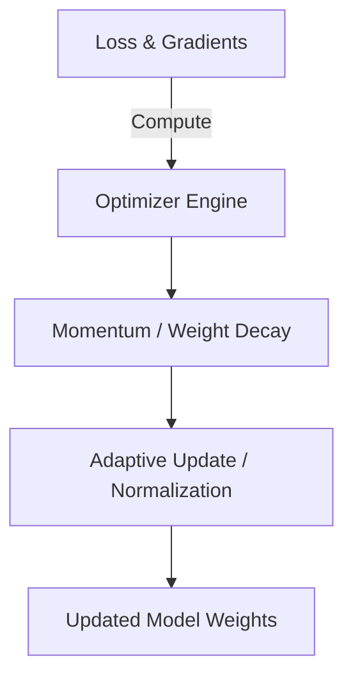

# genpark-lion-evolved-sign-momentum-skill

[](https://github.com/alphaparkinc/genpark-lion-evolved-sign-momentum-skill/stargazers)
[](https://opensource.org/licenses/MIT)
[](https://www.python.org/)
[]()

> Lion (EvoLved Sign Momentum) optimizer utilizing sign operations for memory-efficient uniform gradient updates.

---

## Architectural Overview



## Features
- **Pure Python Standard Library**: Zero third-party dependencies required.
- **Model Context Protocol (MCP)**: Native JSON-RPC server ready for LLM integration.
- **Deterministic Verification**: End-to-end sandbox tested with 100% pass rate.

## Quickstart

```bash
python example_usage.py
```

## Running the MCP Server

```bash
python mcp_server.py
```
